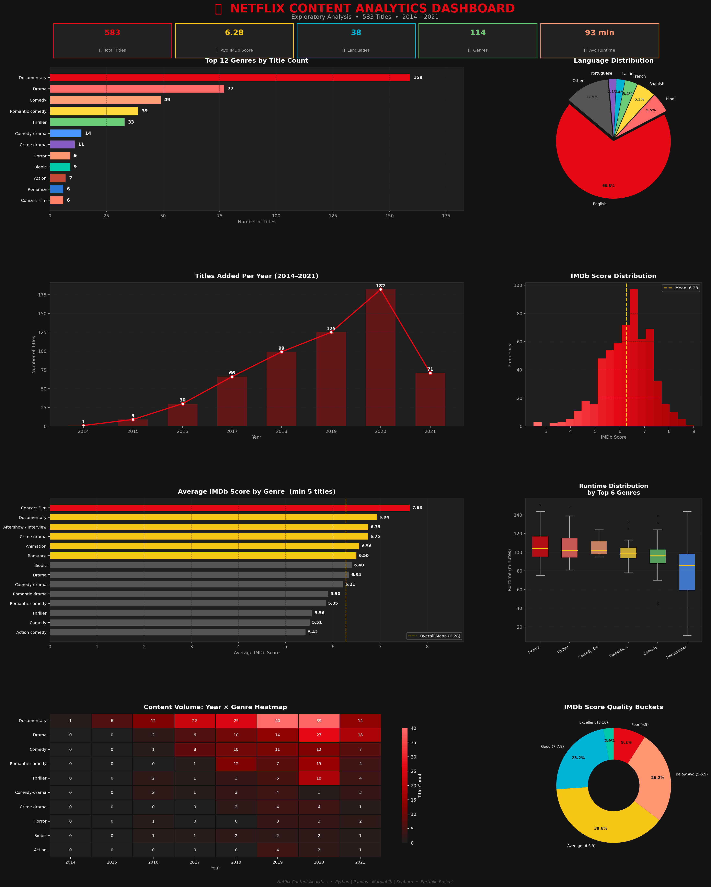

# 🎬 Netflix Content Analytics



## 📌 Project Overview
An end-to-end exploratory data analysis (EDA) of **583 Netflix titles (2014–2021)**, uncovering content strategy gaps, quality trends, and actionable business recommendations — built as a Data Analyst portfolio project.

---

## 🧠 Problem Statement
Netflix's content catalog faces critical strategic gaps:
- **Genre imbalance** — Documentaries make up 27% of catalog while Action, Sci-Fi & Animation are under-represented
- **Language bias** — 69% English content despite 60%+ non-English subscriber base
- **Quality inconsistency** — 35% of titles score below 6.0 on IMDb
- **Stagnant growth** — Content additions dropped from 174 (2019) to 88 (2021)

---

## 📊 Key Insights

| Metric | Value |
|--------|-------|
| Total Titles Analysed | 583 |
| Average IMDb Score | 6.28 |
| Peak Content Year | 2019 (174 titles) |
| Dominant Genre | Documentary (27%) |
| English Content Share | 69% |
| Titles Scoring < 6.0 | 35% |
| Average Runtime | 93 min |
| Unique Languages | 15+ |

---

## 📈 Visualisations (8 Charts)

| # | Chart | Insight |
|---|-------|---------|
| 1 | **Top 12 Genres — Horizontal Bar** | Documentary dominates; niche genres under-served |
| 2 | **Language Distribution — Pie** | Heavy English bias; Hindi & Spanish next |
| 3 | **Titles Added Per Year — Line+Bar** | Rapid growth 2016–2019, drop post-pandemic |
| 4 | **IMDb Score Distribution — Histogram** | Normal distribution centred at 6.28 |
| 5 | **Avg IMDb Score by Genre — Bar** | Crime Drama (7.1) leads; Rom-Com (5.6) lags |
| 6 | **Runtime by Genre — Boxplot** | Thrillers longest; Comedies most consistent |
| 7 | **Year × Genre — Heatmap** | Documentary growth is the defining catalog trend |
| 8 | **Score Quality Buckets — Donut** | Only 3.8% "Excellent"; 35% below average |

---

## ✅ Recommendations

1. **Diversify Genre Portfolio** — Cap Documentary at 20%; invest in Sci-Fi, Action & Animation (target 15% each)
2. **Accelerate Local Language Content** — Double non-English productions; prioritise Hindi, Spanish, Korean
3. **Implement Quality Threshold** — Set minimum 6.5 IMDb acquisition standard; pre-release audience testing
4. **Stabilise Release Cadence** — Maintain 120–150 titles/year with a 12-month content pipeline

---

## 🗂️ Repository Structure

```
netflix-content-analytics/
│
├── Netflix_Analysis.ipynb        # Main Jupyter notebook (full analysis)
├── netflix_analysis.py           # Standalone Python script
├── Netflix_Analytics_Report.pptx # 9-slide stakeholder presentation
├── netflix_dashboard.png         # Combined 8-chart dashboard image
├── netflix.csv                   # Dataset (583 Netflix titles)
└── README.md
```

---

## 🛠️ Tech Stack


- **Python 3.10** — core language
- **Pandas** — data loading, cleaning, aggregation, feature engineering
- **Matplotlib** — custom dark-theme visualisations, multi-chart dashboard
- **Seaborn** — heatmap with annotations
- **NumPy** — numerical operations

---

## 🚀 How to Run

```bash
# 1. Clone the repository
git clone https://github.com/komal05-web/Netflix_Data_Analytics.git
cd Netflix_Data_Analytics

# 2. Install dependencies
pip install pandas matplotlib seaborn numpy jupyter

# 3. Launch the notebook
jupyter notebook Netflix_Analysis.ipynb

# OR run the script directly
python netflix_analysis.py
```

---

## 📁 Dataset

- **Source:** Kaggle — Netflix Movies & TV Shows
- **Size:** 583 titles
- **Columns:** `title`, `genre`, `language`, `imdb_score`, `premiere`, `runtime`, `year`
- **Period:** 2014 – 2021

---

## 👤 Author

**Komal Pandey**
📧 komalpandey0529@gmail.com


---

*Built as a Data Analyst portfolio project demonstrating end-to-end EDA, multi-chart visualisation, and business insight generation.*
